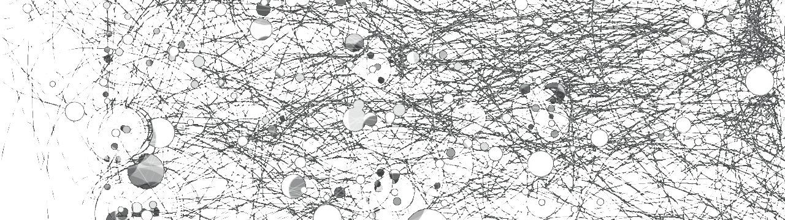

Think of everything as systems with connected dots.

Be around someone eating junk food, watching tiktok, procrastinating, you will be pulled towards obesity, scrolling, mediocrity.

Those examples are dots linked to the system, they are **associated** to it.

What are the things linked to this thing? Do i want them to be linked to me and give them a chance to influence me?

**Scan your environment and cut the strings**

Allowing bad forms of information will lead to contamination of your system, thus, to decay. 

These can apply to any form of information: music, video content, articles, television, environment, relations.

**What do you let yourself perceive?**

