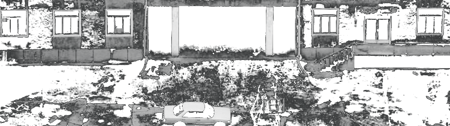

+++
title = 'Broken Windows Theory'
type = "post"
date = '2026-04-01T14:16:19+02:00'
draft = false
+++

> *Leave a broken window on a building, vandals will break more. Leave them unrepaired, squatters will get in and occupy the building. Leave them live in the building, and they will start a fire inside it.*

This theory was introduced by James Q Wilson and George L Kelling in 1982 in an article titled "Broken Windows".

It states that visible signs of crime, antisocial behavior and civil disorder create an urban environment that encourages further crime and disorder.

One un-repaired window is a signal that here, we don't care, and thus, chaos is allowed.

Although it is mainly used in criminology, social sciences and public sphere, i find it exceptionally well working in all fields of perception.

Imagine you're doing a diet to lose excess weight and wonder if you can have a cheat meal. You think: "I've made great progress. I can allow this. It's not as if I eat this every day".

This is a broken window, and this is a signal to yourself that your standards are negotiable. 

It is a signal that here, we don't fully respect our engagements and that we reward ourselves with junk food.

Thus, we don't care, and the building starts to decay, succumbing to entropy.

---

I once saw a man watching a tv concerto for 4 hours straight, with the walls of the toilet behind him left rotting and unfinished. He said he didn't have time to finish it several times, but the truth is he chose not to have time for it.

The wall isn't only a wall, it is an informations emittor.

The informations you receive are that here, we procrastinate, we don't finish things, we pile them up, we make the choice to sweep the dust under the carpet each time we see this wall.

And the way you do one thing, is the way you do everything. So i wasn't surprised when i saw that everything he did was this way.

**Your environment is the reflect of what you really do, not what you pretend to do.**

---

I lost 45kg and got in shape by walking, running, going to the gym, learning nutrition, seeing long-term instead of comfortable short-term.

I stopped illegal activities, cut contact with relationships that dragged me down, stopped cultivating bad values.

I stopped negotiating with broken windows, i'm writing this to make sure i never break another one.
