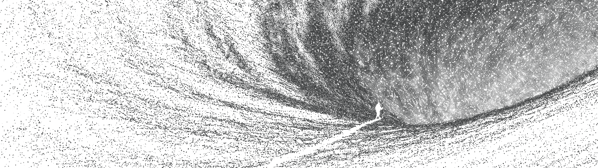

+++
title = 'Entropy'
type = "post"
date = '2026-03-30T10:30:47+02:00'
draft = false
+++

It is the natural order of things. The universe tends towards chaos.

To the universe, it is neutral. To humans, it is lethal.

Maintaining such a complex structure as the human body is a 24/7 battle against nature. Entropy is direct harm to our integrity.

There is no sacred mission or hidden meaning. There is only the persistence of structure until decay.

**To live is to practice negentropy.**

