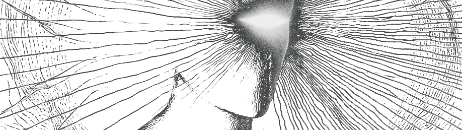

Allowing bad forms of information will lead to contamination of your system, thus, to decay. 

This applies to any form of information: music, video content, articles, television, environment, relationships.

Sad music will affect your mood, television will bring you poor information, bad relationships will vampirize your time with non-relevant events.

They are not helping you fight entropy, but helping entropy fight you, they consume your time, your calories, your potential.

Information is a biological fuel. If you consume noise, you produce decay.

**What do you let yourself perceive?**

