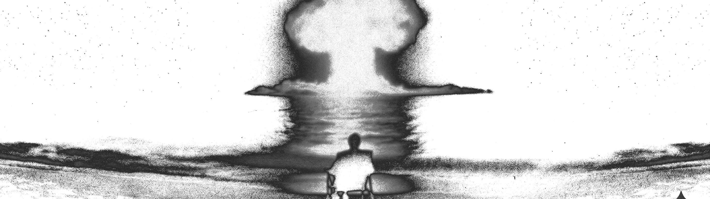

If i wished, i could do it.

This potential zone is deadly. It is hypothetical, virtual, and only satisfying your ego as time passes by.

If you fail, you can tell yourself you didn't push enough, and if you succeed, you now have responsabilities.

Responsabilities leads to having something to lose, having **skin in the game.**

**Do not fear failure or success, both leads to growth, whereas ego protection leads to slow decay.**
